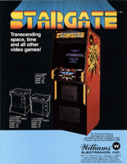
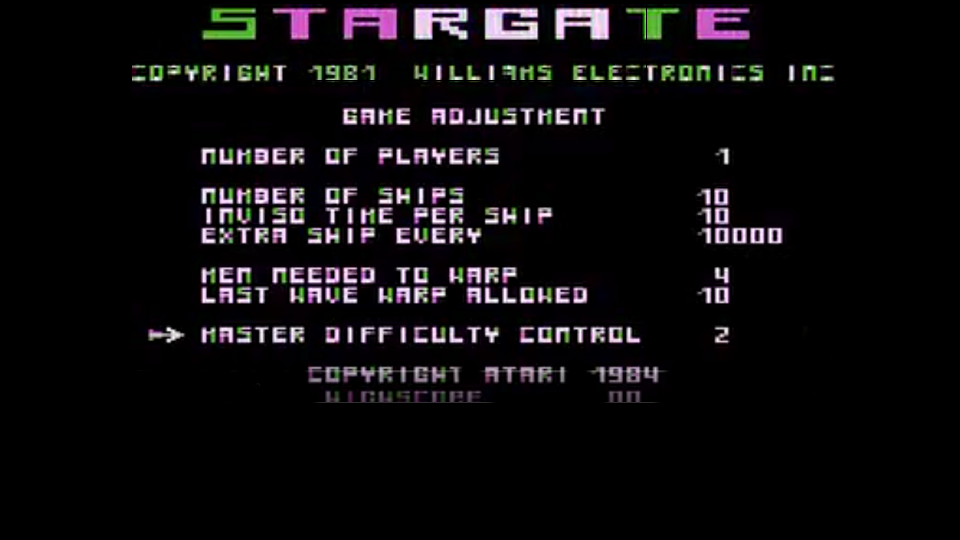
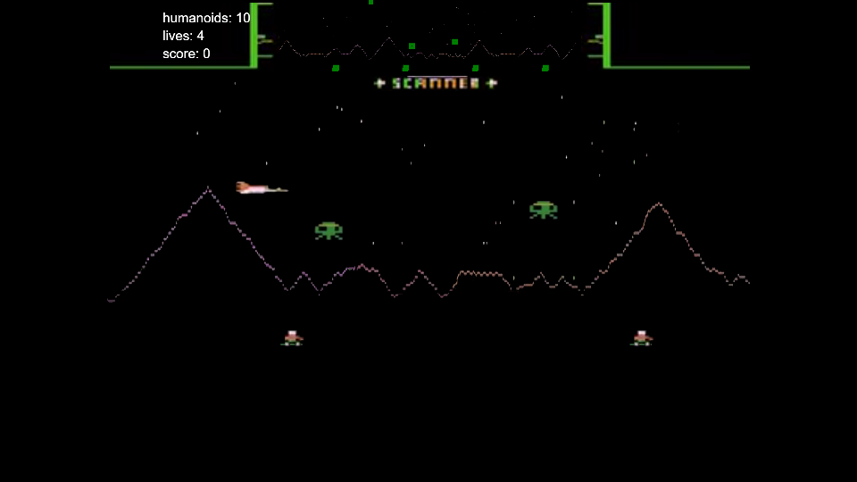
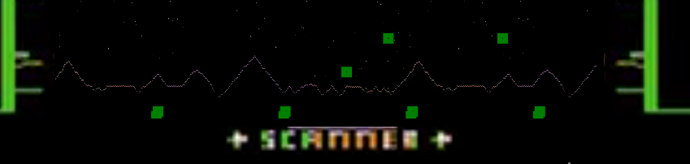
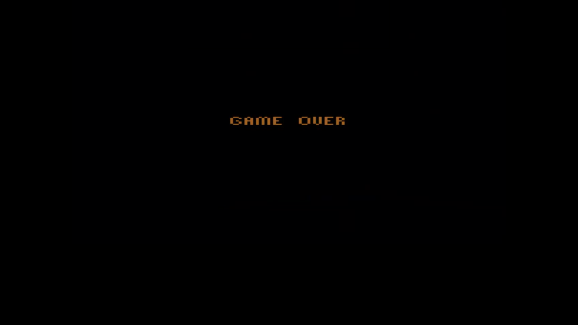

# STARGATE
## Description
This is school project which goal was to writte STARGATE, that can by played on browser. It was restricted to use only plain html and javascript without additional libraries and frameworks.

Short game description quoted from https://en.wikipedia.org/wiki/Stargate_(video_game)

>The player flies a small spaceship above a long, mountainous landscape. The land is inhabited by a small number of humanoids. The landscape wraps around, so flying constantly in one direction will eventually bring the player back to their starting point. The player's ship can fly through the landscape without being destroyed. 
A number of enemy ships fly over the landscape. The player's responsibilities are to destroy all Landers and protect the humans from being captured.



## Screens from the game
### Game starting view

### Gameplay view

### Mini-map

### Game Over

## Running the game
To play this game, just clone this repository, and run index.html file with internet browser. I recommend using Google Chrome.

### Controls: 
1. &#8593; - spaceship up
2. &#x2193; - spaceship down
3. &#x2192; - spaceship right
4. &#x2190; - spaceship left
5. <kbd> SPACE </kbd> - shooting
6. <kbd>↵ Enter</kbd> - Go to next view (start the game/start another wave)


## Desigining your own waves in game
Waves can be easily adjusted and added by modifying `/stargeteatari2/Waves/Waves_JSON.js` file.
```javascript
var wave_1 = '{"waves":[['+
    '{"type":"lander", "amount":"5", "interval":"1"},'+
    '{"type":"pod", "amount":"0", "interval":"2"},'+
    '{"type":"bomber", "amount":"0", "interval":"2"}],['+
    
    '{"type":"lander", "amount":"10", "interval":"1"},'+
    '{"type":"pod", "amount":"0", "interval":"2"},'+
    '{"type":"bomber", "amount":"0", "interval":"2"}]]}';
```
I introduced only three types of enemy, `amount` property in responsible for quantity of certain type of enemy, and interval is time in seconds that allows to adjust fequency of releasing enemy(e.g. in first wave landers are going to be released to the game every second)